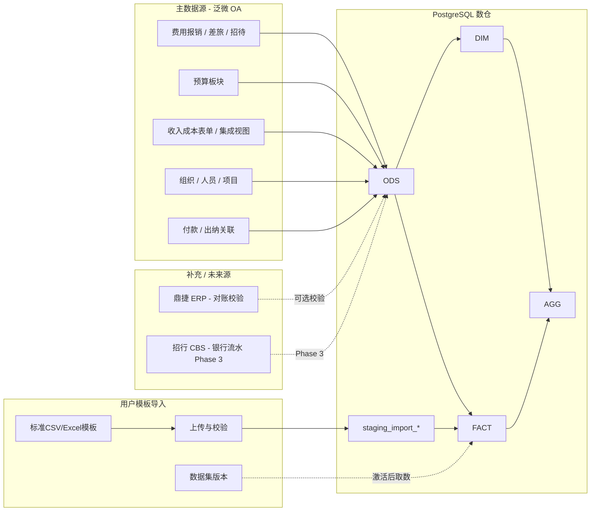
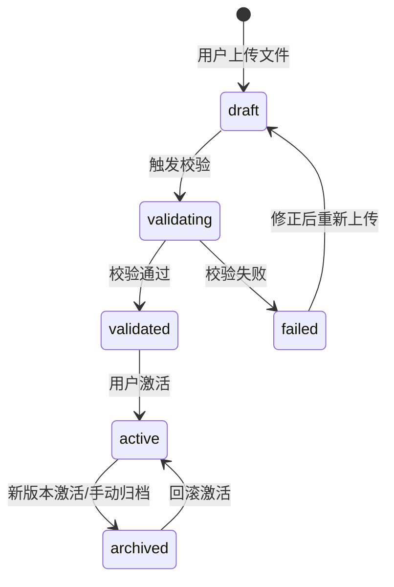
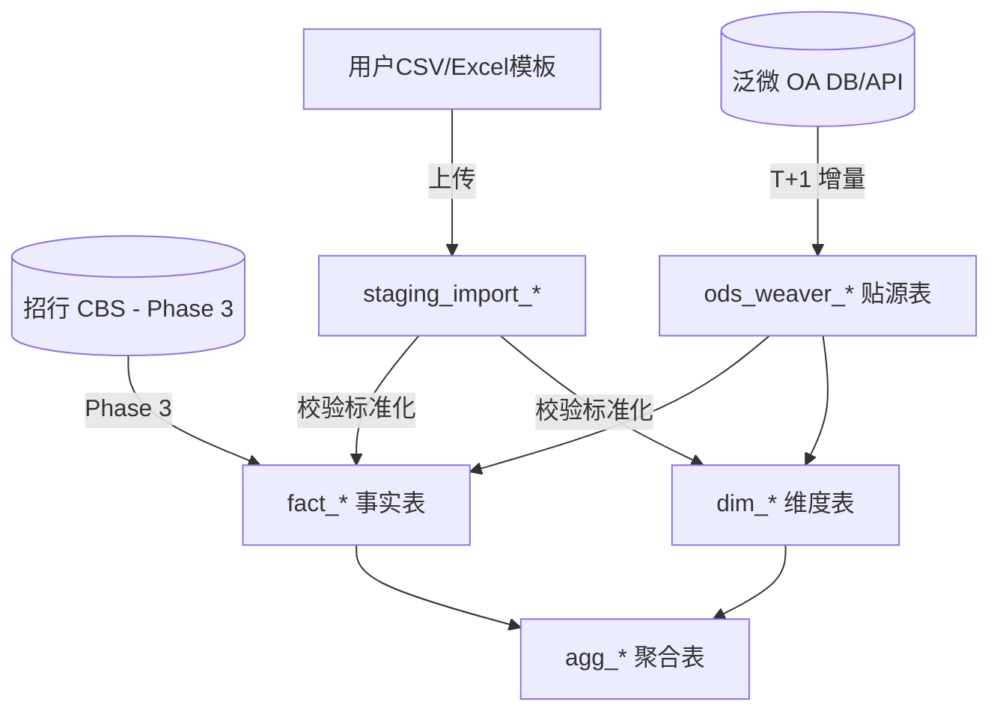

# 爱芯元智企业经营看板 & BI 平台 — 后端 / 数据库 / 接口设计计划

> **文档版本**：v1.2  
> **更新日期**：2026-06-30  
> **前端代码**：`vision-biz-dash-main/`  
> **状态**：规划阶段，尚未开始编码

---

## 1. 项目背景与目标

本项目将现有前端（财务数据看板 + 三个 BI 自助查询平台）完善为可投产的整体系统。前端目前已用 Mock 数据完成 UI 与交互设计，后续需建设：

- **数据集成（ETL）**：从企业现有系统同步至数仓
- **用户模板导入**：支持下载 CSV/Excel 标准模板、填入数据后上传，自动校验并驱动看板与 BI 展示
- **数据仓库（PostgreSQL）**：统一口径、支撑看板预聚合与 BI 动态查询
- **后端 API（Python FastAPI）**：对接前端，提供看板、Query Builder、模板、导出、数据集管理等能力
- **应用元数据库**：用户权限、查询模板、导入数据集、审计日志等

---

## 2. 已确认的技术与业务约束

| 序号 | 事项 | 确认结论 |
|------|------|----------|
| 1 | OA 系统 | **泛微（Weaver e-cology）** |
| 2 | ERP 系统 | **鼎捷（Digiwin）**；收入/成本数据**优先从 OA 获取**（OA 已集成或同步鼎捷数据） |
| 3 | 资金数据 | 后续通过 **招商银行 CBS（Corporate Banking System）** 接入 |
| 4 | 预算数据 | **泛微 OA 预算板块** |
| 5 | 数据时效 | **T+1 可接受**（每日凌晨批处理同步） |
| 6 | 分析数据库 | **暂不使用 ClickHouse**，统一使用 **PostgreSQL** |
| 7 | 后端语言 | **Python（FastAPI）** 优先 |
| 8 | 手工数据接入 | **CSV 优先，Excel 兼容**；用户上传不覆盖官方 ETL 数据 |
| 9 | 数据源切换 | 前端通过 `sourceMode` + `datasetId` 在官方数据与上传数据集间切换 |

### 2.1 架构决策摘要

- 采用**双通道数据源**：企业系统 ETL（OA/ERP/CBS）与用户文件导入均写入同一套标准 `fact_*` / `agg_*` 模型。
- API **不直连**泛微 OA 生产库，由 ETL 只读账号增量/全量同步至 PostgreSQL 数仓。
- **OA 是主数据源**：费用报销、组织人员、预算、收入成本（经 OA 汇聚）。
- **鼎捷 ERP** 作为**对账与补充源**：OA 收入成本字段不全或口径争议时，以 ERP 校验；Phase 1 可不单独接 ERP。
- **招行 CBS** 在 Phase 3 接入；Phase 1/2 资金模块可 Mock 或留空接口。
- **Phase 0 可先打通模板导入**：在 OA ETL 未就绪前，用户通过标准模板上传数据，看板与 BI 即可展示不同数据集。
- 看板读 **聚合表 `agg_*`**，BI Query Builder 读 **事实表 `fact_*` + 维度表 `dim_*`**；两者均支持按 `dataset_id` 隔离取数。

---

## 3. 前端功能清单（设计锚点）

前端路由与模块（`vision-biz-dash-main/src/App.tsx`）：

| 路由 | 页面 | 模式 | 说明 |
|------|------|------|------|
| `/` | 财务数据看板 | 预聚合展示 | KPI、收入毛利趋势、Top 客户、省份地图、产品毛利率、运营费用结构 |
| `/expense-analysis` | 费用 BI | Query Builder | 多维分组、指标、明细/汇总、模板、导出 |
| `/revenue-analysis` | 收入成本 BI | Query Builder | 客户/产品/业务线维度，收入/成本/毛利 |
| `/fund-analysis` | 资金 BI | Query Builder | 银行流水、收支汇总（待 CBS 接入） |

Mock 数据文件：

- `src/data/mockData.ts` — 看板
- `src/data/expenseMockData.ts` — 费用 BI
- `src/data/revenueMockData.ts` — 收入 BI
- `src/data/fundMockData.ts` — 资金 BI

### 3.1 前端现状与取数缺口

前端 UI 与交互已基本完成，但**全部依赖本地 Mock**，尚未接入后端 API 或真实/可替换数据源：

| 模块 | 当前实现 | 缺口 |
|------|----------|------|
| 看板 KPI | `KpiCards` 读取 `mockData.fundBalance` | 无 API；无数据源切换 |
| 收入毛利趋势 | `RevenueChart` 读取 `revenueGrossProfitData` | 无多年动态取数 |
| Top 客户 / 省份地图 / 产品毛利 | 各自读取 `mockData.ts` 静态数组 | 无法随上传数据变化 |
| 运营费用结构 | `ExpensesChart` 读取 `operatingExpenses` | 仅 2024/2025 两个年份 |
| 费用 BI | `ExpenseAnalysis.tsx` 本地 `generateGroupedData()` | 保存模板/导出 Excel 仅为 toast |
| 收入 BI | `RevenueAnalysis.tsx` 本地生成函数 | 同上 |
| 资金 BI | `FundAnalysis.tsx` 本地 `generateFundDetailRows()` | 导出 CSV/Excel 仅为 toast |
| 看板 Header | 硬编码「数据更新: 2025年12月」 | 未接 `meta_data_freshness` |

**关键结论**：展示层已具备 Query Builder、汇总/明细切换、列设置、分页等能力；后端只需提供**统一响应结构**和**数据源切换参数**，前端无需为 CSV 单独写一套图表/表格逻辑。

### 3.2 前端对接目标（模板兼容）

| 位置 | 新增/改造能力 |
|------|---------------|
| `DashboardHeader` | 数据源选择器（官方 / 我的数据集）；展示 `dataAsOf` 与数据集名称 |
| 全局 | 「数据管理」入口：下载模板、上传文件、查看校验结果、激活/回滚数据集 |
| `ExpenseAnalysis` / `RevenueAnalysis` / `FundAnalysis` | 顶部增加「下载模板」「上传数据」「当前数据集」；查询请求携带 `sourceMode`、`datasetId` |
| 看板各图表组件 | 改为 React Query 调用 `/dashboard/*`；响应结构与现有 Mock 字段对齐 |
| 新增 `src/services/api.ts` | 封装 API Client、统一错误处理、数据源上下文 |

**前端统一数据源上下文（建议）：**

```typescript
interface DataSourceContext {
  sourceMode: "official" | "dataset";
  datasetId?: string;       // sourceMode=dataset 时必填
  domain?: "expense" | "revenue" | "fund" | "dashboard";
}
```

---

## 4. 数据源与泛微 OA 映射

### 4.1 数据源总览



### 4.2 泛微 OA 典型表/模块参考

> 以下为泛微 e-cology 常见结构，**实际上线前需对照贵司 OA 版本与二次开发表单做字段映射**。

| 业务域 | 泛微常见来源 | 同步至数仓 |
|--------|--------------|------------|
| 组织架构 | `HrmDepartment`、`HrmSubCompany`、`HrmResource` | `dim_department`、`dim_entity`、`dim_employee` |
| 费用报销 | 流程表单（报销单 `formtable_main_*` / 明细 `formtable_main_*_dt*`） | `fact_expense` |
| 审批状态 | `workflow_requestbase`（`currentnodetype`、`status`） | `fact_expense.approval_status` |
| 费用科目 | 表单字段 + 科目映射配置表 | `dim_expense_subject` |
| 项目 | 项目模块 / 自定义台账 | `dim_project` |
| 客户 / 供应商 | CRM 模块 / 自定义档案 | `dim_customer`、`dim_supplier` |
| 预算 | 预算板块（预算编制、执行、占用） | `fact_budget` |
| 收入成本 | OA 自定义表单或集成中间表（来自鼎捷） | `fact_revenue_cost` |
| 付款关联 | 付款申请流程，关联报销单号 | `fact_fund_transaction.linked_doc_no`（Phase 3 与 CBS 对账） |

### 4.3 鼎捷 ERP 的定位

- **当前策略**：收入、成本、产品、客户等**以 OA 已同步的数据为准**，不在 Phase 1 单独建设 ERP ETL。
- **保留扩展**：在 `fact_revenue_cost` 增加 `source_system`（`OA` / `DIGIWIN`）字段，便于后续双源比对。
- **对账场景**：月结后财务可触发「OA vs 鼎捷」差异报表（Phase 4 可选）。

### 4.4 招行 CBS 的定位（Phase 3）

- 接入账户余额、交易流水、对手方、摘要等。
- 映射至 `fact_fund_transaction`、`fact_fund_balance_snapshot`。
- `business_source` 枚举：`CBS`、`OA报销`、`ERP`、`手工录入` 等。
- CBS 与 OA 报销单通过 `linked_doc_no` / 付款单号关联。

### 4.5 预算（泛微 OA 预算板块）

- 同步预算编制额、占用额、执行额（按期间 + 主体 + 维度）。
- 支撑前端指标：**预算差异额、预算差异率**。
- 计算口径：
  - 预算差异额 = 实际发生额（`fact_expense` 或 `fact_revenue_cost` 汇总）− 预算额（`fact_budget`）
  - 预算差异率 = 预算差异额 / 预算额 × 100%

### 4.6 用户上传模板数据源

#### 4.6.1 适用场景

| 场景 | 说明 |
|------|------|
| OA ETL 未就绪 | Phase 0 先用模板导入演示端到端能力 |
| 临时分析 | 财务用 Excel 整理的数据快速导入做 BI 查询 |
| 外部数据对比 | 导入第三方/手工台账，与官方 OA 数据对比 |
| 培训与演示 | 使用脱敏样例数据展示看板效果 |

#### 4.6.2 与官方 ETL 数据的关系

- **不覆盖原则**：用户上传数据写入独立 `dataset_id` 分区，**永不覆盖** `source_system=OA/CBS` 的官方数据。
- **优先级**：前端默认 `sourceMode=official`；用户显式选择某数据集后才切换。
- **口径一致**：模板字段映射到标准 `fact_*` 列，经同一套 Query Engine 与聚合逻辑出数，保证 BI 指标口径一致。

#### 4.6.3 业务域与模板类型

| 模板 code | 业务域 | 对应事实表 | 支撑前端 |
|-----------|--------|------------|----------|
| `tpl_expense_detail` | expense | `fact_expense` | 费用 BI、看板费用结构 |
| `tpl_revenue_cost_detail` | revenue | `fact_revenue_cost` | 收入 BI、看板收入/客户/产品/地图 |
| `tpl_fund_transaction` | fund | `fact_fund_transaction` | 资金 BI、看板 KPI |
| `tpl_budget` | expense（辅助） | `fact_budget` | 预算差异指标 |
| `tpl_dashboard_bundle` | dashboard | 多表打包 | 一次性导入看板所需全部域（可选） |

#### 4.6.4 模板字段规范

- 模板 CSV **第一行为英文 column key**（稳定、供后端映射），**第二行为中文 label**（用户阅读）。
- 金额列统一以**元**入库；前端展示沿用现有「万/亿」格式化。
- 日期格式：`YYYY-MM-DD` 或 `YYYY-MM`（期间字段）。
- 枚举字段（主体、费用大类、审批状态、币种等）提供 `meta_import_template.enum_sheet` 或在模板附带 `_dict.csv` 字典表。

**费用明细模板示例（节选）：**

| column key | 中文 label | 必填 | 说明 |
|------------|------------|------|------|
| `trans_date` | 发生日期 | 是 | YYYY-MM-DD |
| `entity_name` | 主体 | 是 | 枚举：集团/上海/深圳/北京 |
| `department_name` | 部门 | 是 | 自由文本，自动 upsert 至 dim |
| `expense_category` | 费用大类 | 是 | 销售/管理/研发/制造费用 |
| `expense_subject` | 费用科目 | 是 | |
| `amount` | 金额 | 是 | 单位：元 |
| `currency` | 币种 | 否 | 默认 CNY |
| `doc_no` | 单据号 | 是 | 同 dataset 内唯一 |
| `approval_status` | 审批状态 | 否 | 已审批/审批中/已驳回 |
| `summary` | 摘要 | 否 | |

#### 4.6.5 数据集生命周期



| 状态 | 说明 |
|------|------|
| `draft` | 文件已上传，待校验 |
| `validating` | 后台异步校验与标准化中 |
| `validated` | 校验通过，可预览，未生效 |
| `failed` | 校验失败，可下载错误报告 |
| `active` | 当前用户/团队生效中的数据集 |
| `archived` | 历史版本，可回滚 |

**激活规则：**

- 每个用户每个 `domain` 仅允许 **1 个 active 数据集**（团队共享数据集按 `team_id` 计）。
- 激活后触发 `refresh_aggregates(dataset_id)` 刷新该数据集专属 `agg_*` 分区。
- 支持回滚至上一 archived 版本。

#### 4.6.6 导入校验规则

| 级别 | 规则 | 处理 |
|------|------|------|
| 阻断 | 缺少必填列、日期/数值格式错误、枚举值非法 | 拒绝入库，生成错误行报告 |
| 阻断 | 同 dataset 内 `doc_no` 重复 | 拒绝或按策略覆盖（可配置） |
| 警告 | 部门/客户/产品在 dim 中不存在 | 自动 upsert 或提示用户确认 |
| 警告 | 金额异常（负数、超大值） | 入库但标记 `quality_flag` |
| 警告 | 跨表引用不一致（如 budget 无对应 expense 主体） | 提示，不阻断 |

---

## 5. 数据库设计（PostgreSQL）

采用 **单库多 Schema** 或 **逻辑分表前缀**，建议：

- `dw_*` — 数仓（维度、事实、聚合）
- `meta_*` — 应用元数据
- `ods_*` — 贴源层（可选，便于追溯）
- `staging_*` — 用户导入临时层（校验前/raw 数据）

### 5.1 维度表（`dim_*`）

| 表名 | 说明 | 主要来源 |
|------|------|----------|
| `dim_entity` | 法人主体（集团、爱芯元智上海/深圳/北京） | OA 分部 `HrmSubCompany` |
| `dim_department` | 部门树、成本中心 | OA `HrmDepartment` |
| `dim_employee` | 员工 / 销售人员 | OA `HrmResource` |
| `dim_customer` | 客户编号、名称、区域、省份 | OA 客户档案 |
| `dim_supplier` | 供应商 | OA 供应商档案 |
| `dim_project` | 研发 / 量产项目 | OA 项目台账 |
| `dim_product` | 产品编号、品名、规格、汇报型号 | OA 产品主数据 |
| `dim_business_line` | 业务线（智能安防、智能驾驶、AIoT 等） | OA 分类映射 |
| `dim_expense_subject` | 费用科目 + 大类（销售/管理/研发/制造） | OA 科目 + 映射表 |
| `dim_cost_center` | 成本中心 | OA |
| `dim_bank_account` | 银行账户（CBS 接入后完善） | CBS |
| `dim_date` | 日期维（年月周日） | 生成 |
| `dim_currency` | 币种、汇率 | OA / 配置 |
| `dim_region` | 销售区域、省份 | OA 客户区域 |
| `dim_approval_status` | 审批状态枚举 | OA 流程状态 |

### 5.2 事实表（`fact_*`）

#### `fact_expense`（费用，对应前端 `dw_expense_fact`）

| 字段组 | 字段示例 |
|--------|----------|
| 主键 / 单据 | `expense_id`, `doc_no`, `oa_request_id` |
| 时间 | `trans_date`, `period_month` |
| 维度外键 | `entity_id`, `department_id`, `employee_id`, `customer_id`, `project_id`, `supplier_id`, `expense_subject_id`, `cost_center_id` |
| 分类 | `expense_category`（销售/管理/研发/制造费用） |
| 金额 | `amount_local`, `amount_group`, `currency`, `exchange_rate` |
| 预算 | `budget_amount`（冗余或关联 `fact_budget`） |
| 流程 | `approval_status`, `summary` |
| 溯源 | `source_system`, `source_id`, `etl_batch_id`, `updated_at` |
| 数据集 | `dataset_id`（NULL=官方 ETL）, `import_batch_id` |

> 所有 `fact_*` 表均增加 `dataset_id`（nullable）与 `import_batch_id`（nullable）。官方 ETL 写入时 `dataset_id IS NULL`；用户导入写入时带具体 `dataset_id`，Query Engine 通过 `sourceMode` 决定过滤条件。

#### `fact_revenue_cost`（收入成本，对应 `dw_revenue_cost_fact`）

| 字段组 | 字段示例 |
|--------|----------|
| 主键 / 单据 | `line_id`, `doc_no` |
| 时间 | `trans_date`, `period_month` |
| 维度外键 | `entity_id`, `business_line_id`, `customer_id`, `employee_id`, `product_id`, `region_id` |
| 属性 | `sales_channel`, `province`, `revenue_type`（收入/成本） |
| 度量 | `quantity`, `unit_price`, `revenue`, `cost`, `gross_profit`, `gross_margin` |
| 币种 | `currency`, `amount_local`, `amount_group` |
| 溯源 | `source_system`（默认 `OA`）, `source_doc_id`, `etl_batch_id` |

#### `fact_budget`（预算，来自 OA 预算板块）

| 字段 | 说明 |
|------|------|
| `period_month`, `entity_id` | 期间、主体 |
| `dimension_type`, `dimension_id` | 预算维度（部门/科目/项目等） |
| `budget_amount` | 预算编制额 |
| `occupied_amount` | 占用额（可选） |
| `actual_amount` | 执行/实际（可与 fact 汇总交叉验证） |

#### `fact_fund_transaction`（资金流水，Phase 3 CBS）

| 字段 | 说明 |
|------|------|
| `trans_id`, `trans_date` | 流水号、交易日期 |
| `entity_id`, `bank_account_id` | 主体、账户 |
| `counterparty` | 交易对手 |
| `income_amount`, `expense_amount`, `balance_after` | 收支与余额 |
| `trans_type`, `summary` | 交易类型、摘要 |
| `business_source` | CBS / OA报销 / ERP 等 |
| `linked_doc_no` | 关联 OA 报销单 / 付款单 |
| `currency` | 币种 |

#### `fact_fund_balance_snapshot`（资金余额快照，供看板 KPI）

| 字段 | 说明 |
|------|------|
| `snapshot_date`, `entity_id` | 快照日、主体 |
| `account_type` | 银行存款 / 现金 / 短期投资 |
| `amount`, `currency` | 余额 |
| `mom_change_pct` | 较上月变化率 |

### 5.3 聚合表（`agg_*`，专供看板）

| 表名 | 用途 | 对应前端组件 |
|------|------|--------------|
| `agg_revenue_monthly` | 按月收入、毛利、毛利率（多年） | `RevenueChart` |
| `agg_expense_by_category` | 按年运营费用结构 | `ExpensesChart` |
| `agg_customer_top` | Top N 客户、占比、同比 | `TopCustomers` |
| `agg_product_margin` | 产品毛利率排行 | `ProductMarginChart` |
| `agg_region_sales` | 省份销售额 | `ChinaMapChart` |
| `agg_fund_balance_monthly` | 资金 KPI 及环比 | `KpiCards` |

> 所有 `agg_*` 表增加 `dataset_id`（nullable）。官方数据 `dataset_id IS NULL`；用户数据集激活后为该 `dataset_id` 单独维护聚合分区（或通过 `(dataset_id, ...)` 复合键区分）。

### 5.4 应用元数据表（`meta_*`）

| 表名 | 用途 |
|------|------|
| `meta_user` | 用户（对接泛微 SSO） |
| `meta_role`, `meta_role_permission` | 角色与数据权限（主体/部门/业务线） |
| `meta_query_template` | 保存的 BI 查询模板 |
| `meta_query_share` | 分享链接 token |
| `meta_query_log` | 查询与导出审计 |
| `meta_export_job` | 异步 Excel 导出任务 |
| `meta_dimension_dict`, `meta_metric_dict` | Query Builder 维度/指标元数据 |
| `meta_etl_batch`, `meta_data_freshness` | ETL 批次与数据更新时间（看板 Header 展示） |
| `meta_import_template` | 导入模板定义（code、domain、列 schema、枚举字典） |
| `meta_import_dataset` | 用户数据集（名称、domain、状态、owner、激活时间） |
| `meta_import_batch` | 单次上传批次（文件路径、行数、校验结果摘要） |
| `meta_import_error` | 校验错误明细（行号、列、错误码、错误信息） |
| `meta_field_mapping` | 模板列 → 标准字段映射（支持版本演进） |
| `meta_user_dataset_pref` | 用户当前激活的数据集偏好（按 domain） |

### 5.5 导入临时层（`staging_import_*`）

| 表名 | 说明 |
|------|------|
| `staging_import_expense` | 费用原始行（校验前） |
| `staging_import_revenue_cost` | 收入成本原始行 |
| `staging_import_fund` | 资金流水原始行 |
| `staging_import_budget` | 预算原始行 |

**staging 表公共字段：**

| 字段 | 说明 |
|------|------|
| `staging_id` | 主键 |
| `batch_id` | 关联 `meta_import_batch` |
| `row_no` | 源文件行号 |
| `raw_json` | 原始行 JSON（保留未映射列） |
| `parse_status` | pending / ok / error |
| `error_codes` | 校验错误码数组 |

**处理流程：** 上传 → 写入 staging → 校验 → 标准化写入 `fact_*` + 自动 upsert `dim_*` → 刷新 `agg_*`（按 dataset_id）。

### 5.6 导入元数据表结构（要点）

#### `meta_import_template`

| 字段 | 说明 |
|------|------|
| `template_code` | 如 `tpl_expense_detail` |
| `domain` | expense / revenue / fund / dashboard |
| `version` | 模板版本号 |
| `column_schema` | JSON：列 key、label、type、required、enum_ref |
| `sample_file_url` | 空模板下载地址 |
| `is_active` | 是否当前可用版本 |

#### `meta_import_dataset`

| 字段 | 说明 |
|------|------|
| `dataset_id` | UUID |
| `name` | 用户命名，如「2025Q1 费用试算」 |
| `domain` | expense / revenue / fund / dashboard |
| `owner_user_id` | 创建者 |
| `visibility` | private / team / org |
| `status` | draft / validating / validated / failed / active / archived |
| `active_batch_id` | 当前生效批次 |
| `row_count` | 入库行数摘要 |
| `data_as_of` | 数据截止期间 |

---

## 6. 后端架构（Python FastAPI）

### 6.1 技术栈

| 组件 | 选型 |
|------|------|
| Web 框架 | FastAPI |
| ORM | SQLAlchemy 2.x |
| 数据库驱动 | asyncpg / psycopg2 |
| 迁移 | Alembic |
| 任务调度 | APScheduler（轻量）或 Airflow（若 IT 已有） |
| 缓存 | Redis（看板聚合、维度字典、权限） |
| 认证 | 泛微 SSO（OAuth2/CAS）+ JWT |
| 导出 | openpyxl / pandas |
| 文件解析 | pandas + openpyxl（CSV/Excel）；chardet 编码检测 |
| 对象存储 | 本地磁盘（dev）/ MinIO 或 OSS（prod），存放上传文件与错误报告 |
| 配置 | pydantic-settings + `.env` |

### 6.2 推荐目录结构

```text
axera_dashboard/
├── vision-biz-dash-main/          # 前端（已有）
├── docs/
│   └── backend-design-plan.md       # 本文档
├── backend/
│   ├── app/
│   │   ├── main.py
│   │   ├── config.py
│   │   ├── api/v1/
│   │   │   ├── auth.py
│   │   │   ├── dashboard.py
│   │   │   ├── bi_query.py
│   │   │   ├── metadata.py
│   │   │   ├── templates.py
│   │   │   ├── export.py
│   │   │   ├── import_templates.py  # 模板下载
│   │   │   └── datasets.py          # 上传/校验/激活/回滚
│   │   ├── services/
│   │   │   ├── query_engine.py      # 统一 BI 查询引擎
│   │   │   ├── metrics.py           # 同比/环比/预算差异/毛利率
│   │   │   ├── permission.py        # 数据权限注入
│   │   │   ├── export_service.py
│   │   │   ├── import_service.py    # 文件解析、校验、标准化
│   │   │   ├── template_service.py  # 模板生成与版本管理
│   │   │   └── dataset_service.py   # 数据集生命周期
│   │   ├── models/                  # SQLAlchemy models
│   │   └── schemas/                 # Pydantic 请求/响应
│   ├── requirements.txt
│   └── alembic/
├── etl/
│   ├── jobs/
│   │   ├── sync_oa_organization.py
│   │   ├── sync_oa_expense.py
│   │   ├── sync_oa_budget.py
│   │   ├── sync_oa_revenue_cost.py
│   │   ├── sync_cbs_fund.py         # Phase 3
│   │   ├── refresh_aggregates.py
│   │   └── import_standardize.py    # staging → fact/dim 标准化
│   ├── weaver/                    # 泛微 OA 连接器（只读）
│   │   ├── client.py
│   │   └── mappers/
│   └── config/
└── sql/
    ├── 01_dimensions.sql
    ├── 02_facts.sql
    ├── 03_aggregates.sql
    ├── 04_meta.sql
    └── 05_staging_import.sql
```

### 6.3 BI Query Engine 设计

三个 BI 页面（费用 / 收入 / 资金）共用一套查询引擎，通过 `domain` 区分。

**数据源参数（所有看板 GET 与 BI POST 均支持）：**

| 参数 | 类型 | 说明 |
|------|------|------|
| `sourceMode` | `official` \| `dataset` | 官方 ETL 或用户数据集 |
| `datasetId` | UUID | `sourceMode=dataset` 时必填 |
| `asOfBatchId` | string | 可选，查看某历史批次快照（审计/回滚预览） |

**过滤规则：**

- `sourceMode=official` → `WHERE dataset_id IS NULL AND source_system IN ('OA','CBS',...)`
- `sourceMode=dataset` → `WHERE dataset_id = :datasetId`（仍叠加数据权限谓词）

**请求体结构：**

```json
{
  "domain": "expense | revenue | fund",
  "sourceMode": "official | dataset",
  "datasetId": "uuid-optional",
  "filters": { },
  "groupBy": ["department", "expense_subject"],
  "metrics": ["amount", "expenseRate", "yoy"],
  "granularity": "summary | detail | both",
  "sort": { "field": "amount", "direction": "desc" },
  "pagination": { "page": 1, "pageSize": 20 },
  "search": ""
}
```

**响应体结构：**

```json
{
  "columns": [{ "key": "amount", "label": "费用发生额", "unit": "万", "type": "number" }],
  "rows": [],
  "total": 0,
  "queryTime": "2026-06-18T10:30:00",
  "sqlPreview": "SELECT ...",
  "dataAsOf": "2026-05-31",
  "sourceMode": "dataset",
  "datasetId": "uuid",
  "datasetName": "2025Q1 费用试算"
}
```

**安全规则：**

- 维度、指标仅允许 `meta_dimension_dict` / `meta_metric_dict` 白名单映射到 SQL 列。
- 禁止前端传入原始 SQL。
- 自动注入 `entity_id IN (...)` 等权限谓词。
- 明细查询强制分页；超过阈值走异步导出。
- `sourceMode=dataset` 时校验当前用户对 `datasetId` 的读权限（owner / team / org）。
- 禁止跨 dataset 与 official 混合查询。

**指标计算（配置化）：**

| 指标 key | 计算逻辑 |
|----------|----------|
| `amount` / 费用发生额 | SUM(amount) |
| `expenseRate` / 费用率 | SUM(expense) / SUM(revenue) × 100 |
| `yoy` / 同比 | 本期 vs 去年同期 |
| `mom` / 环比 | 本期 vs 上期 |
| `budgetDiff` / 预算差异额 | SUM(actual) − SUM(budget) |
| `budgetDiffRate` / 预算差异率 | budgetDiff / SUM(budget) × 100 |
| `perCapita` / 人均费用 | SUM(expense) / COUNT(DISTINCT employee_id) |
| `grossMargin` / 毛利率 | SUM(revenue − cost) / SUM(revenue) × 100 |
| `netFlow` / 净流入 | SUM(income) − SUM(expense) |

---

## 7. API 接口规划

**Base URL**：`/api/v1`  
**认证**：`Authorization: Bearer <JWT>`  
**数据时效**：T+1（官方数据）或数据集 `data_as_of`；响应中带 `dataAsOf`、`sourceMode`、`datasetId` 字段

### 7.1 公共 / 元数据

| 方法 | 路径 | 说明 |
|------|------|------|
| GET | `/auth/me` | 当前用户与数据权限 |
| GET | `/meta/data-freshness?sourceMode=&datasetId=` | 数据更新时间（看板 Header） |
| GET | `/meta/entities` | 主体列表 |
| GET | `/meta/currencies` | 币种列表 |
| GET | `/meta/dimensions?domain=expense&sourceMode=&datasetId=` | Query Builder 可用维度 |
| GET | `/meta/metrics?domain=expense` | Query Builder 可用指标 |
| GET | `/meta/datasets?domain=` | 当前用户可见的数据集列表 |

### 7.2 看板（预聚合，GET）

所有看板接口支持 Query 参数：`sourceMode=official|dataset`、`datasetId=`、`entity=`、`period=` 等。

| 方法 | 路径 | 对应前端 |
|------|------|----------|
| GET | `/dashboard/fund-kpi?entity=&period=&sourceMode=&datasetId=` | `KpiCards` |
| GET | `/dashboard/revenue-trend?years=&entity=&sourceMode=&datasetId=` | `RevenueChart` |
| GET | `/dashboard/top-customers?limit=5&period=&entity=&sourceMode=&datasetId=` | `TopCustomers` |
| GET | `/dashboard/region-sales?period=&entity=&sourceMode=&datasetId=` | `ChinaMapChart` |
| GET | `/dashboard/product-margin?period=&limit=5&sourceMode=&datasetId=` | `ProductMarginChart` |
| GET | `/dashboard/expense-structure?year=&entity=&sourceMode=&datasetId=` | `ExpensesChart` |

### 7.3 BI 查询（POST）

| 方法 | 路径 | 说明 |
|------|------|------|
| POST | `/bi/query/expense` | 费用 Query Builder |
| POST | `/bi/query/revenue` | 收入成本 Query Builder |
| POST | `/bi/query/fund` | 资金 Query Builder（Phase 3 完整数据） |
| POST | `/bi/query/{domain}/export` | 触发 Excel 导出，返回 jobId |
| GET | `/bi/export/{jobId}` | 下载导出文件 |

### 7.4 查询模板与分享

| 方法 | 路径 | 说明 |
|------|------|------|
| GET | `/bi/templates?domain=expense` | 我的模板列表 |
| POST | `/bi/templates` | 保存模板 |
| GET | `/bi/templates/{id}` | 加载模板 |
| PUT | `/bi/templates/{id}` | 更新模板 |
| DELETE | `/bi/templates/{id}` | 删除模板 |
| POST | `/bi/templates/{id}/share` | 生成分享链接 |
| GET | `/bi/share/{token}` | 通过 token 恢复查询条件 |

### 7.5 模板下载与数据集导入

| 方法 | 路径 | 说明 |
|------|------|------|
| GET | `/import/templates?domain=expense` | 列出可用模板及版本 |
| GET | `/import/templates/{code}/download` | 下载空模板 CSV（含 column key + 中文 label 行） |
| GET | `/import/templates/{code}/download.xlsx` | 下载 Excel 版（Phase 0 可选） |
| POST | `/import/datasets` | 创建数据集（name、domain、visibility） |
| POST | `/import/datasets/{id}/upload` | 上传 CSV/Excel（multipart），返回 batchId |
| GET | `/import/batches/{batchId}` | 查询校验进度与摘要 |
| GET | `/import/batches/{batchId}/preview` | 预览前 N 行标准化结果 |
| GET | `/import/batches/{batchId}/errors` | 下载错误报告 CSV |
| POST | `/import/datasets/{id}/activate` | 激活数据集（触发 agg 刷新） |
| POST | `/import/datasets/{id}/rollback` | 回滚至上一 archived 版本 |
| DELETE | `/import/datasets/{id}` | 删除 draft/failed/archived 数据集 |
| GET | `/import/datasets/{id}` | 数据集详情 |

**上传响应示例：**

```json
{
  "batchId": "batch-uuid",
  "datasetId": "dataset-uuid",
  "status": "validating",
  "totalRows": 1200,
  "message": "文件已接收，正在校验"
}
```

**校验完成响应示例：**

```json
{
  "batchId": "batch-uuid",
  "status": "validated",
  "totalRows": 1200,
  "successRows": 1185,
  "errorRows": 15,
  "warnings": 32,
  "canActivate": false,
  "errorReportUrl": "/api/v1/import/batches/batch-uuid/errors"
}
```

### 7.6 费用 BI 请求示例

```json
{
  "sourceMode": "dataset",
  "datasetId": "dataset-uuid",
  "filters": {
    "periodStart": "2024-07",
    "periodEnd": "2025-06",
    "entity": "集团",
    "currency": "本位币",
    "expenseRanges": ["销售费用", "管理费用", "研发费用"],
    "expenseSubjects": []
  },
  "groupBy": ["部门", "费用科目"],
  "metrics": ["费用发生额", "费用率", "同比"],
  "granularity": "汇总数据",
  "pagination": { "page": 1, "pageSize": 20 }
}
```

### 7.7 收入 BI 请求示例

```json
{
  "sourceMode": "official",
  "filters": {
    "entity": "集团",
    "currency": "本位币",
    "periodStart": "2024-07",
    "periodEnd": "2025-06",
    "businessLines": [],
    "regions": [],
    "customers": [],
    "revenueTypes": ["收入", "成本"]
  },
  "dimensions": ["客户名称", "品名"],
  "metrics": ["收入", "成本", "毛利", "毛利率"],
  "granularity": "汇总数据"
}
```

### 7.8 资金 BI 请求示例（CBS 接入后）

```json
{
  "sourceMode": "dataset",
  "datasetId": "fund-dataset-uuid",
  "filters": {
    "startDate": "2025-01",
    "endDate": "2025-12",
    "entity": "集团合并",
    "direction": "全部",
    "currencies": ["CNY"],
    "businessSources": []
  },
  "dimensions": ["transDate", "counterparty"],
  "metrics": ["incomeAmount", "expenseAmount", "netFlow"],
  "granularity": "summary"
}
```

---

## 8. ETL 同步策略（T+1）

### 8.1 调度时间表（建议）

| 时间 | 任务 | 数据源 |
|------|------|--------|
| 01:00 | 同步组织架构、人员 | 泛微 OA |
| 01:30 | 同步维度主数据（客户、产品、科目映射） | 泛微 OA |
| 02:00 | 同步费用报销（增量） | 泛微 OA |
| 02:30 | 同步预算编制与执行 | 泛微 OA 预算板块 |
| 03:00 | 同步收入成本（增量） | 泛微 OA |
| 03:30 | 刷新聚合表 `agg_*` | PostgreSQL |
| 04:00 | 更新 `meta_data_freshness` | — |
| Phase 3 | 同步 CBS 流水（可改为每小时） | 招行 CBS |

### 8.2 同步原则

- 泛微 OA 使用**只读数据库账号**或官方 API（若已采购 ESBO/API 网关）。
- 增量键：`lastoperatedate` / `modifydate` / 流程归档时间（按实际表字段定）。
- 每条事实记录保留 `oa_request_id`、`etl_batch_id` 便于追溯。
- ETL 失败告警 + 批次状态写入 `meta_etl_batch`。
- 前端看板展示「数据更新: YYYY年MM月」来自 `meta_data_freshness`。

### 8.3 数据流



### 8.4 用户导入处理流程

| 步骤 | 动作 | 输出 |
|------|------|------|
| 1 | 用户下载空模板 | CSV/Excel 文件 |
| 2 | 填写数据并上传 | `meta_import_batch` + 原始文件存储 |
| 3 | 解析写入 staging | `staging_import_*` |
| 4 | 校验（类型/枚举/重复/引用） | `meta_import_error` 或 validated |
| 5 | 标准化入库 | `fact_*` + upsert `dim_*`（带 dataset_id） |
| 6 | 用户激活数据集 | `meta_import_dataset.status=active` |
| 7 | 刷新聚合 | `agg_*`（按 dataset_id 分区） |
| 8 | 前端切换 sourceMode | 看板与 BI 自动呈现新数据 |

---

## 9. 权限与安全

### 9.1 认证

- 对接**泛微 SSO**（OAuth2 / CAS），登录成功后签发 JWT。
- Refresh Token 存 Redis，Access Token 短过期（如 2h）。

### 9.2 数据权限（按角色）

| 角色 | 权限范围 |
|------|----------|
| 集团财务 | 全部主体、全部模块 |
| 子公司财务 | 仅本主体（上海/深圳/北京） |
| 部门负责人 | 本部门费用 + 授权业务线收入 |
| 销售 | 本区域/本客户收入（成本字段可按策略脱敏） |

权限在 Query Engine 层自动注入 SQL WHERE 条件。

### 9.3 数据集权限

| 操作 | 集团财务 | 数据集 owner | 同 team 成员 | 其他用户 |
|------|----------|--------------|--------------|----------|
| 下载模板 | ✅ | ✅ | ✅ | ✅ |
| 上传/创建数据集 | ✅ | ✅（private/team） | 按 team 策略 | ❌ |
| 激活/删除自己的数据集 | ✅ | ✅ | 按 team 策略 | ❌ |
| 读取 team/org 数据集 | ✅ | ✅ | ✅ | org 可见时 ✅ |
| 读取 official 数据 | 按角色 | 按角色 | 按角色 | 按角色 |

- 上传文件大小限制（建议 20MB）与行数限制（建议 10 万行/批）。
- 导入审计写入 `meta_query_log` 扩展表或独立 `meta_import_audit`（用户、文件名、行数、结果）。

### 9.4 审计

- 所有 BI 查询、导出记录写入 `meta_query_log`（用户、时间、domain、filters 摘要、返回行数、sourceMode、datasetId）。
- 所有导入操作记录：上传、校验、激活、回滚、删除。

---

## 10. 分阶段实施计划

### Phase 0 — 模板导入 + 端到端演示（约 2–3 周）

**目标**：在 OA ETL 未就绪前，用户可通过 CSV 模板上传数据，看板与 BI 自动呈现不同数据集。

**后端：**

- [ ] PostgreSQL DDL：`staging_import_*`、`meta_import_*`、fact/agg 增加 `dataset_id`
- [ ] 标准模板定义：`tpl_expense_detail`、`tpl_revenue_cost_detail`、`tpl_fund_transaction`
- [ ] FastAPI：`/import/templates/*`、`/import/datasets/*`、`/import/batches/*`
- [ ] `import_service`：CSV 解析、校验、标准化、`refresh_aggregates(dataset_id)`
- [ ] Query Engine 支持 `sourceMode` / `datasetId`
- [ ] 看板 6 个 GET + BI 3 个 POST 对接数据集取数

**前端：**

- [ ] 新增 `src/services/api.ts` 与 `DataSourceContext`
- [ ] `DashboardHeader`：数据源选择器 + 数据管理入口
- [ ] 看板 6 组件改为 React Query 调 API
- [ ] 三个 BI 页：下载模板、上传数据、校验结果展示、数据集切换
- [ ] 保留 Mock 作为 `VITE_USE_MOCK=true` 开发回退

**交付标准：**

- 用户下载费用/收入/资金模板 → 填入样例 → 上传 → 校验通过 → 激活 → 看板与 BI 展示上传数据
- 可在 official（空/样例）与 dataset 间切换，图表与表格字段与现有 Mock 一致
- 校验失败可下载错误行报告

### Phase 1 — 费用域 + 看板费用图（约 4–6 周）

**目标**：费用 BI 可用，看板运营费用结构有真实 OA 数据；模板导入继续可用。

- [ ] 调研泛微 OA 报销表单表名与字段映射
- [ ] 搭建 PostgreSQL 数仓 DDL（dim + fact_expense + fact_budget + agg_expense）
- [ ] 实现 ETL：`sync_oa_organization`、`sync_oa_expense`、`sync_oa_budget`
- [ ] FastAPI：`POST /bi/query/expense`、元数据接口
- [ ] 看板：`GET /dashboard/expense-structure`
- [ ] 前端 `ExpenseAnalysis.tsx` 对接 API（含 sourceMode 切换）
- [ ] 官方 ETL 与上传数据集并存，默认 `sourceMode=official`

**交付标准**：T+1 费用汇总/明细查询与 Mock 字段一致，预算差异指标可算；上传数据集仍可独立使用。

### Phase 2 — 收入成本 + 看板其余图表（约 4–6 周）

**目标**：收入 BI 可用，看板 5 块图表全部有真实数据。

- [ ] 调研 OA 收入成本表单（鼎捷数据在 OA 中的落地表）
- [ ] ETL：`sync_oa_revenue_cost`
- [ ] 聚合表：`agg_revenue_monthly`、`agg_customer_top`、`agg_product_margin`、`agg_region_sales`
- [ ] FastAPI：看板 5 个 GET + `POST /bi/query/revenue`
- [ ] 前端 `RevenueAnalysis.tsx` 及看板图表对接 API
- [ ] 收入模板 `tpl_revenue_cost_detail` 与 OA ETL 字段对齐

**交付标准**：Top 客户、产品毛利、省份地图、收入趋势与 OA 月结数据一致；模板导入可用于临时试算。

### Phase 3 — 招行 CBS 资金域（约 3–4 周）

**目标**：资金 BI 与看板 KPI 可用。

- [ ] 对接 CBS API / 文件接口，明确字段与安全要求
- [ ] ETL：`sync_cbs_fund`、`fact_fund_balance_snapshot`
- [ ] OA 报销单与 CBS 流水关联（`linked_doc_no`）
- [ ] FastAPI：`POST /bi/query/fund`、`GET /dashboard/fund-kpi`
- [ ] 前端 `FundAnalysis.tsx`、`KpiCards` 对接 API
- [ ] 资金模板与 CBS 字段映射文档

**交付标准**：银行流水查询、收支汇总、余额 KPI 与 CBS T+1 数据一致。

### Phase 4 — 平台能力（约 2–3 周）

**目标**：查询模板、导出、SSO、审计、数据集共享上线。

- [ ] 泛微 SSO 集成
- [ ] 查询模板 CRUD、分享链接
- [ ] Excel 异步导出（含 dataset 数据源）
- [ ] 数据权限与查询/导入审计
- [ ] ETL 监控与 `data-freshness` 展示
- [ ] 数据集 team/org 共享与 `tpl_dashboard_bundle` 打包导入（可选）

---

## 11. 待调研事项

### 11.1 OA ETL（Phase 1 启动前）

以下信息需与 OA 管理员 / 财务 / IT 联合确认，并补充到 `docs/weaver-field-mapping.md`（后续新建）：

1. 泛微 e-cology **具体版本号**（ECology8 / ECology9 / 云版本）
2. OA 数据库类型（SQL Server / Oracle / MySQL）及是否开放**只读从库**
3. 报销流程 **formtable_main_xxx** 表名与各字段含义
4. 收入成本在 OA 中的**表单或视图名**（鼎捷同步字段清单）
5. 预算板块表结构（编制维度：部门/科目/项目？）
6. 主体（分部）与 `HrmSubCompany` 的 ID 对应关系
7. 本位币 / 集团币换算规则与汇率来源
8. 是否已有泛微 **API 网关 / ESBO**，优先 API 还是 DB 直读
9. CBS 接入方式（API / SFTP / 银企直联）与预计上线时间
10. 用户规模与并发预期（决定 Redis、连接池配置）

### 11.2 模板导入（Phase 0 启动前）

1. 各域模板**必填字段**与**可选字段**最终清单（与财务确认）
2. 枚举字典来源：固定配置 vs 用户上传 `_dict.csv` vs 从 OA dim 同步
3. 金额单位与精度：统一元入库，展示万/亿由前端格式化
4. 日期格式容忍度：是否接受 `YYYY/MM/DD`、Excel 序列号
5. 维度自动创建策略：未知部门/客户/产品是否自动 upsert
6. 单据号重复策略：拒绝 / 覆盖 / 追加版本
7. 单文件行数上限与单用户数据集数量上限
8. 数据集可见范围：private / team / org 的默认策略
9. 是否需要 `tpl_dashboard_bundle` 一次性导入看板全量数据
10. 模板版本升级时旧版 CSV 的兼容策略

---

## 12. 环境与部署建议

| 环境 | 用途 |
|------|------|
| dev | 开发，可连 OA 测试库 |
| staging | 预发，OA 只读从库 + 脱敏 |
| prod | 生产，ETL 与 API 分离部署 |

- PostgreSQL：主库供 ETL 写入；API 读**只读账号**（或只读副本）。
- Redis：单机即可，后续按并发扩展。
- 前端：Vite 构建静态资源，Nginx 反代 `/api` 至 FastAPI。
- 敏感配置（OA 库密码、CBS 密钥）走环境变量或密钥管理服务，不入 Git。

---

## 13. 修订记录

| 版本 | 日期 | 说明 |
|------|------|------|
| v1.0 | 2026-06-18 | 初版，基于前端 Mock 与通用架构 |
| v1.1 | 2026-06-18 | 纳入确认约束：泛微 OA、鼎捷 ERP（收入成本走 OA）、招行 CBS、OA 预算、T+1、PostgreSQL、Python |
| v1.2 | 2026-06-30 | 新增用户 CSV/Excel 模板导入、数据集版本管理、双通道数据源、sourceMode/datasetId 取数、Phase 0 端到端计划 |

---

## 14. 相关文档（规划）

| 文档 | 状态 | 说明 |
|------|------|------|
| `docs/backend-design-plan.md` | ✅ 本文档 | 总体设计计划 |
| `docs/import-template-spec.md` | 待编写 | CSV/Excel 模板字段规范与样例 |
| `docs/weaver-field-mapping.md` | 待编写 | 泛微 OA 字段级映射 |
| `docs/api-spec.yaml` | 待编写 | OpenAPI 规范 |
| `sql/01_dimensions.sql` | 待编写 | 数仓 DDL |
| `sql/05_staging_import.sql` | 待编写 | 导入 staging 与 meta_import DDL |
| `templates/` | 待编写 | 空模板 CSV/Excel 文件（tpl_expense_detail 等） |
